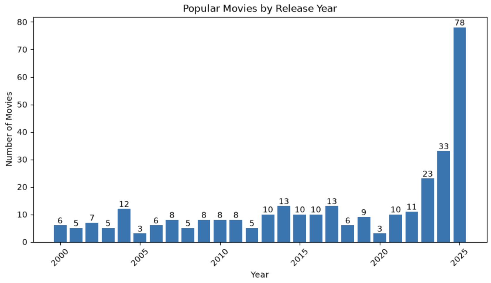
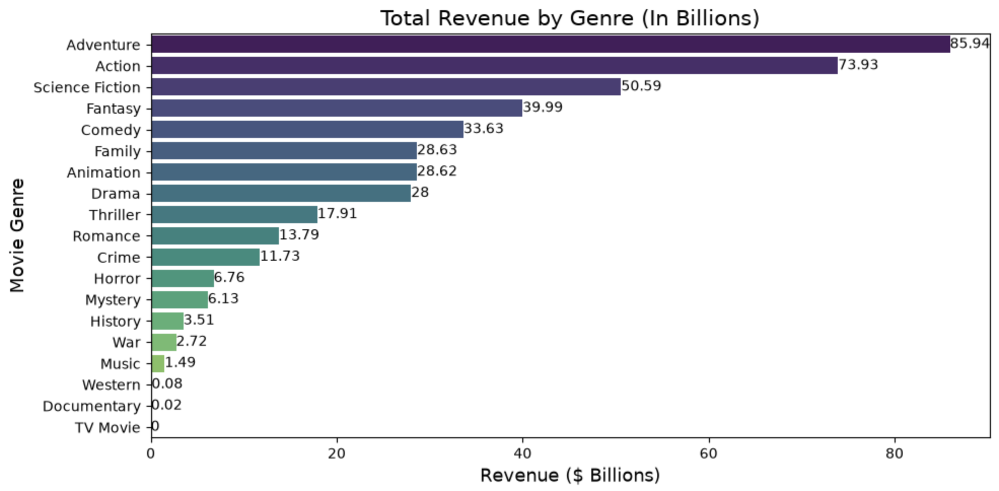
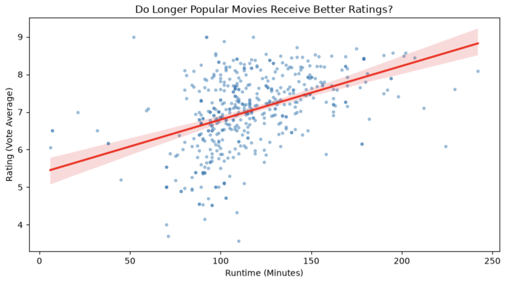
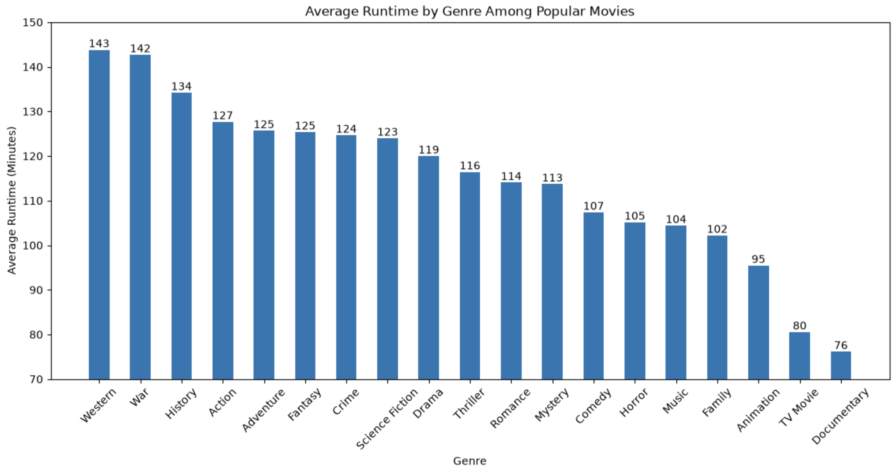
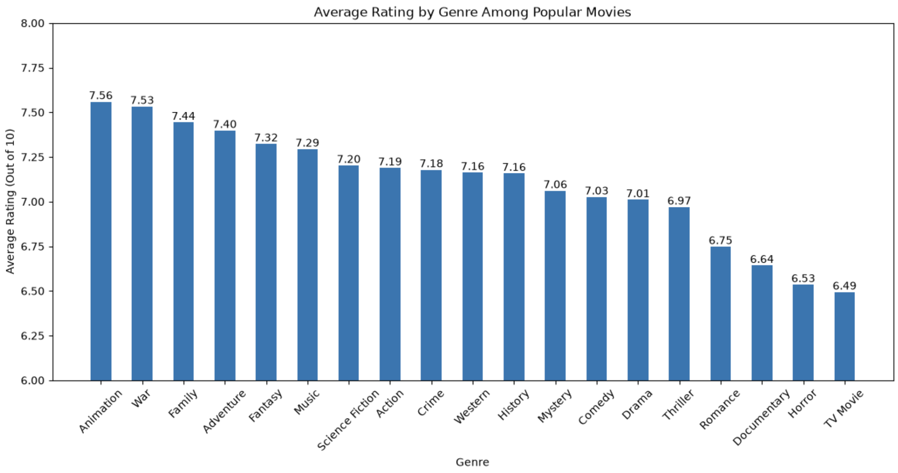

# Movie Data Analysis

## Overview

This project collects and analyzes movie data using the TMDB API. The analysis explores popular movies by release year, revenue by genre, runtime, and ratings.

## Technologies

- Python
- pandas
- Matplotlib
- Seaborn
- TMDB API
- Jupyter Notebook

## Project Structure

- `data_collection.ipynb` — Collects movie data from the TMDB API
- `analysis.ipynb` — Cleans, analyzes, and visualizes the movie dataset
- `movies_data.csv` — Collected movie dataset
- `question1.png` — Popular movies by release year
- `question2.png` — Revenue by genre
- `question3.png` — Runtime vs. rating
- `question4.png` — Average runtime by genre
- `question5.png` — Average rating by genre

## Analysis

### Popular Movies by Release Year

How are currently popular movies distributed by release year?

### Revenue by Genre

Which movie genres generate the highest total revenue among popular movies?

### Runtime vs. Rating

Is movie runtime associated with rating among popular movies?

### Average Runtime by Genre

What is the average movie runtime by genre?

### Average Rating by Genre

What is the average movie rating by genre?

## Notes

The data collection notebook uses Google Colab Secrets for the TMDB API key. The API key itself is not stored in the notebook or repository.
